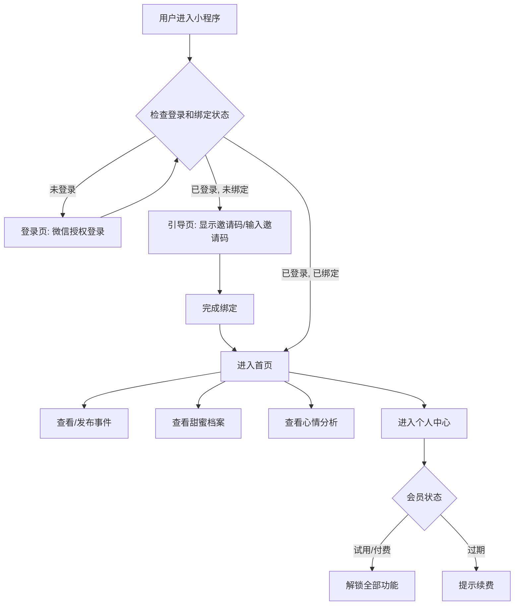

# **功能描述文档 — 「恋心物语」**

## **1. 应用核心价值 (Core Value Proposition)**

**「恋心物语」** 是一款专为情侣设计的私密情感记录与沟通小程序。它旨在帮助情侣通过记录生活中的"记仇"与"甜蜜"事件，增进彼此的理解，将潜在的矛盾转化为感情升温的契机。

## **2. 目标用户 (Target Audience)**

-   **核心用户**: 处于长期稳定关系中，希望为平淡生活增添趣味和仪式感的年轻情侣 (18-30岁)。
-   **潜在用户**: 新建立关系，希望加深彼此了解的情侣。

## **3. 核心功能模块 (Core Modules)**

### **模块一：首页 / 情感仪表盘 (Dashboard)**

-   **功能描述**: 这是打开 **「恋心物语」** 后看到的第一个页面，是情侣情感状态的"晴雨表"。
-   **关键元素**:
    -   **情侣信息**: 显示双方的头像和昵称。
    -   **恋爱纪念日**: 从在一起的第一天开始计时，显示"我们已经相爱了 XXX 天"。
    -   **爱情指数 (Love Score)**: 一个动态变化的进度条，范围0-100。初始值为50，根据"记仇"和"甜蜜"事件动态增减，直观反映当前的情感亲密度。
    -   **近期"未解决"事件**: 列表形式展示最近几条需要关注的"记仇"事件，提醒用户及时沟通。
    -   **悬浮操作按钮 (+)**: 快速进入"记仇"或"记录甜蜜"的发布页面。

### **模块二：事件记录与解决 (Event Tracking & Resolution)**

-   **功能描述**: **「恋心物语」** 的核心玩法。用户可以记录让TA生气(记仇)或开心(甜蜜)的事件。
-   **"记仇"流程**:
    1.  **发布**: 用户A发布一条"记仇"事件，必须包含：
        -   **内容描述**: 发生了什么事。
        -   **发生日期**: 事件发生的具体日期。
        -   **心情标签**: 例如"非常生气"、"有点委屈"、"无语了"等，每个标签对应不同的扣分值。
        -   **图片上传 (可选)**: 上传图片作为"证据"。
    2.  **通知**: 用户B收到新事件的通知。
    3.  **查看与回应**: 用户B可以查看事件详情，并可以添加"心情回应"(例如点一个"委屈巴巴"的表情)。
    4.  **解决**: 任何一方都可以将事件标记为"已解决"，但必须填写**"解决方案"**(例如"承诺以后再也不犯了"、"罚请吃一顿大餐"等)。解决后，根据事件的严重程度，爱情指数会回升一部分分数(但不是全部)。
-   **"记录甜蜜"流程**:
    -   **发布**: 流程类似"记仇"，但心情标签为"超开心"、"很感动"等，会增加"爱情指数"。甜蜜事件默认就是"已解决"状态。

### **模块三：甜蜜档案 (Sweet Archive)**

-   **功能描述**: 这里是所有"已解决"事件的归档，是情侣间专属的"历史博物馆"。
-   **内容**:
    -   按时间倒序展示所有已解决的"记仇"事件和所有"甜蜜"事件。
    -   用户可以筛选只看"记仇"或只看"甜蜜"。
    -   这是回顾感情历程、发现问题模式、珍惜甜蜜瞬间的地方。

### **模块四：心情分析 (Mood Analytics)**

-   **功能描述**: 通过数据可视化，帮助情侣洞察情感变化的趋势和模式。
-   **图表类型**:
    -   **心情趋势图**: 以周或月为单位，展示双方心情指数(1-10分)的折线图，可以直观地看到谁在哪段时间情绪波动较大。
    -   **心情分布饼图**: 统计一段时间内，所有事件中各种"心情标签"的占比，了解是"生气"多还是"感动"多。

### **模块五：甜蜜留言板 (Sweet Message Board)**

-   **功能描述**: 一个给对方留惊喜和情话的私密空间。
-   **玩法**:
    -   双方都可以匿名或实名发布简短的留言。
    -   可以设置某条留言为"置顶"，让对方一打开就能看到。
    -   留言板内容与"记仇"事件完全隔离，是一个纯粹的"撒糖"区。

### **模块六：个人中心与会员体系 (Profile & Subscription)**

-   **功能描述**: 管理个人信息、情侣关系和会员订阅。
-   **关键功能**:
    -   **个人资料编辑**: 修改昵称、头像。
    -   **情侣绑定/解绑**:
        -   未绑定的用户可以通过邀请码与另一半绑定。
        -   用户可以主动解除绑定关系，数据将被保留。如果之后和同一个人重新绑定，历史数据可以恢复。
    -   **会员中心**:
        -   新用户绑定后有30天免费试用期，可体验全部功能。
        -   试用期结束后，核心功能(如发布新事件)将被限制，需要付费订阅(提供月度、年度套餐)才能解锁。
        -   付费用户拥有无限记录空间、高级数据分析、自定义主题等特权。

## **4. 非功能性需求 (Non-Functional Requirements)**

-   **性能**: 小程序启动速度快，页面切换流畅，列表滚动不卡顿。
-   **UI/UX**: 界面设计严格遵循"手绘日系软萌"风格，交互动效自然、可爱。
-   **安全性**: 用户数据(特别是涉及隐私的事件内容)必须加密传输和存储。
-   **兼容性**: 在主流iOS和Android机型上表现一致。

## **5. 整体流程图 (High-Level Flowchart)**

